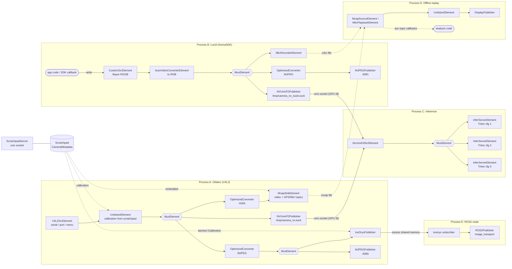

# camera_driver

A composable GStreamer pipeline framework for cameras, written in C++20. Pipelines are
assembled from small, self-registering `PipelineElement`s and described in YAML — no
per-camera code required. Runs standalone (plain CMake) or as a ROS2 node.

## Why

Camera pipelines (capture → convert/encode → publish) tend to get hardcoded per-topology
and per-camera. This framework makes them declarative and hardware-aware instead:

- **Config-driven**: describe a pipeline in YAML, not C++.
- **Hardware-aware**: `OptimizedConverter` picks the best available encode path
  (`nvh264enc`/`nvv4l2h264enc` on NVIDIA, `qsvh264enc` on Intel, `x264enc` fallback)
  without you specifying it.
- **Composable**: fan out to multiple outputs (RTSP, MJPEG HTTP, on-screen display,
  MKV/MCAP recording, iceoryx, ROS2) from one source via `MuxElement`.
- **ROS2-optional**: the core has no ROS2 dependency; the ROS2 publisher/node is an
  opt-in layer on top.

## Architecture

- `Pipeline` — holds a chain of `PipelineElement`s, resolves/validates GStreamer caps
  between them, assembles the pipeline string, and runs it via a GLib main loop.
- `RTSPPipeline` — subclass that serves the pipeline via `GstRTSPMediaFactory` instead
  of playing it directly.
- `YAMLPipeline` — builds a `Pipeline`/`RTSPPipeline` from a YAML config; generic over
  element types via `ElementRegistry`, so adding a new element type needs no changes
  here.
- `ElementRegistry` + `REGISTER_PIPELINE_ELEMENT` — elements self-register at static
  init; the executable force-links them via `-Wl,--whole-archive`.
- `UnresolvedSegment` — elements that need upstream/downstream caps or hardware
  capabilities are resolved lazily at `build()` time via a `PipelineContext`.

### Elements (`src/elements/`, `include/camera_driver/elements/`)

Every element below is registered by its class name and usable from YAML via `type:`.
Elements fall into four roles: **sources** start a pipeline, **transforms** sit in the
middle, **fan-out** splits a stream, and **sinks** end a branch.

#### Sources

| Element | Purpose |
|---|---|
| `V4L2SrcElement` | Camera capture; selects a device by serial, USB port, format, or interactive menu (fallback chain, tried in order) |
| `RTSPSourceElement` | Pull an RTSP stream as a source |
| `NvUnixFdSrcElement` | Receive GPU frames from another process over a Unix socket (`nvunixfdsrc`); pairs with `NVUnixFDPublisher`. Falls back to `videotestsrc` if the plugin is missing |
| `CustomSrcElement` | `appsrc` wrapper: push raw frames (incl. Bayer) from application code with `write()`, e.g. SDK-driven cameras with no V4L2 node |
| `MkvPlaybackElement` | Play back an `.mkv` recording (HW decode, SW fallback) and publish its embedded calibration to the scratchpad |
| `McapSourceElement` | Replay an `.mcap` recording: video channel through HW decode, plus per-topic callbacks for aux data (GPS, IMU, ...) delivered in sync with the video |

#### Transforms

| Element | Purpose |
|---|---|
| `OptimizedConverter` | Hardware-aware convert/encode to H264 or MJPEG, with resize |
| `OptimizedVideoResize` | Hardware-aware resize only (C++ API; not registered for YAML) |
| `AutoVideoConverterElement` | Plain format-negotiating converter; inserts `bayer2rgb` etc. automatically |
| `UndistortElement` | GPU (`nvdewarper` pinhole projection) or CPU (`camera_driver_undistort` `GstVideoFilter`) undistort, driven by calibration from the scratchpad. Rewrites the scratchpad calibration with `D` cleared so downstream sinks see rectified metadata. Passthrough when no calibration is present |
| `InferServerElement` | DeepStream `nvinferserver` (Triton) with a `config_file`. Inference metadata is not consumed or republished yet (see `NOTES.md`) |
| `GstElement` | Escape hatch: append any GStreamer element (`element:` + `properties:`); caps are inferred from its pad templates |

#### Fan-out

| Element | Purpose |
|---|---|
| `MuxElement` | Wraps `tee`; each branch is its own resolved chain ending in a sink. Branches can contain nested `MuxElement`s |

#### Sinks / recorders

| Element | Purpose |
|---|---|
| `MkvRecorderElement` | Record to MKV, embedding camera calibration/pose as metadata |
| `McapSinkElement` | Record to MCAP: video on a fixed channel (`camera/frame`) plus any number of schema-free aux topics via `writeTopic()`; calibration stored as a file-level `camera-metadata` record |

### Publishers (`src/publishers/`)

Publishers are sink elements, normally placed in `MuxElement` branches.

| Publisher | Output |
|---|---|
| `MJPEGPublisher` | MJPEG over HTTP (dashboards, browser preview) |
| `DisplayPublisher` | On-screen debug window with FPS/latency overlay |
| `NVUnixFDPublisher` | Unix socket, NvBufSurface fd passing: zero-copy GPU handoff to another process (`NvUnixFdSrcElement`) |
| `NvCUDAPublisher` | NvBufSurface + GstCudaMemory delivered to a CUDA callback (CUDA-only build) |
| `IceOryxPublisher` | Raw frames into iceoryx shared memory (`Service/Instance/Event` topic) plus a latched `.../Calibration` topic carrying the scratchpad metadata (needs `CAMERA_DRIVER_WITH_ICEORYX`) |
| `ROS2Publisher` | `image_transport` + optional `camera_info` (ROS2 build only) |
| `CustomPublisher` | `appsink` wrapper: pull (`read()`) or callback API for application code |

### Metadata (`src/metadata/`)

`CameraMetadata` — calibration (camera matrix, distortion) and pose, read from/written
to YAML (including the ROS `camera_info`-style schema) or embedded in MKV recordings.
Pipeline elements share metadata via a small in-process scratchpad rather than passing
it through constructors. Set `metadata_file:` or `calibration_file:` under
`pipeline:` in the YAML to seed it; sources like `MkvPlaybackElement` populate it from
recordings. `ScratchpadServer`/`ScratchpadClient` expose it to other processes over a
Unix socket.

## Example: a complex deployment

Nothing limits a pipeline to a single linear chain. Every element is self-contained and
`MuxElement` branches nest, so one process can ingest several kinds of camera,
undistort, record, preview, and feed inference, while separate processes (inference,
ROS2 bridge, replay) attach over Unix sockets and shared memory.



`config/orbbec_lucid_pipeline.yaml` is a concrete two-camera + inference version of
this. What the diagram illustrates:

- **Encode once, reuse**: a converter before a nested `MuxElement` feeds several
  consumers (iceoryx + HTTP) from one encode.
- **Raw taps for inference**: a branch that skips encoding hands the GPU frame to
  another process with no encode/decode round trip.
- **Calibration flows through the scratchpad**, not constructors: whatever loads it
  (YAML, recording, app code) makes it available to undistort, recorders and publishers.
- **Record and replay are symmetric**: `MkvRecorderElement`/`McapSinkElement` pair with
  `MkvPlaybackElement`/`McapSourceElement`, and replay restores calibration and aux data.

## Build

Core build (no ROS2):

```bash
cmake -B build -DCAMERA_DRIVER_WITH_ROS2=OFF -DCAMERA_DRIVER_WITH_RTSP=ON
cmake --build build
```

Produces `camera_driver_core` (static lib) and `camera_driver_exe` (standalone binary).

### CMake options

| Option | Default | Effect |
|---|---|---|
| `CAMERA_DRIVER_WITH_ROS2` | `OFF` | Builds `camera_driver_ros2` lib + `camera_driver_ros2_node`; requires `rclcpp`, `sensor_msgs`, `image_transport`, `camera_info_manager` |
| `CAMERA_DRIVER_WITH_RTSP` | `ON` | Enables `RTSPPipeline`; requires `libgstrtspserver-1.0-dev` |
| `CAMERA_DRIVER_WITH_CUDA` | `OFF` | Enables `NvCUDAPublisher`; requires the CUDA toolkit, `gstreamer-cuda-1.0`, and a DeepStream SDK root (`CAMERA_DRIVER_DEEPSTREAM_DIR`) |
| `CAMERA_DRIVER_WITH_ICEORYX` | `OFF` | Enables `IceOryxPublisher`; requires system-installed `iceoryx_posh` |
| `CAMERA_DRIVER_BUILD_CUDA_DEMO` | `OFF` | Builds `examples/cuda_display_demo`; requires `CAMERA_DRIVER_WITH_CUDA` + OpenCV, kept in a separate executable (see note below) |

Deliberately no OpenCV in `camera_driver_core`: OpenCV's libjpeg link collides with
`libnvds_lljpeg.so`'s private jpeg symbols and aborts the process if run alongside
`nvjpegenc`. Anything needing OpenCV (e.g. `cuda_display_demo`) is its own executable.

### ROS2 build

```bash
colcon build --packages-select camera_driver --cmake-args -DCAMERA_DRIVER_WITH_ROS2=ON
```

## Running

```bash
camera_driver_exe path/to/pipeline.yaml
```

See `config/example_pipeline.yaml` for an annotated RTSP + fan-out example, and
`config/debug_display.yaml` for a minimal MJPEG + on-screen display pipeline. A YAML
config declares a `pipeline:` (type + options) and an `elements:` list, each entry
naming a registered element type and its options.

## Docker

Both images (GPU `dev`, CPU-only `nogpu`) are built and published to
`ghcr.io/davidnoronha1/camera_driver` by GitHub Actions
(`.github/workflows/docker-build.yml`) on every push. Local tooling pulls those
published images instead of building:

```bash
# Prefer the published image; build locally only if it hasn't been published yet.
make pull-docker            # or: make pull-docker-nogpu
docker compose run --rm camera_driver bash
```

`docker-compose.yml` references the published images, so a plain `docker compose run`
pulls them on first use (compose's default `pull_policy: missing`) instead of
building. To rebuild locally explicitly (e.g. for a change that isn't published
yet), `make build-docker` / `make build-docker-nogpu` — the local build shadows the
published image until you `docker compose pull` again.

The container mounts the repo at `/workspace/camera_driver` (edit pipelines/configs
without rebuilding), forwards X11 for `DisplayPublisher`, and requests the NVIDIA
runtime. See `docker/Dockerfile` and `docker-compose.yml` for details, including why
several DeepStream base-image codec packages need `--reinstall`.

## Zig core and web runtime (experimental)

`zig/` contains a second implementation of the pipeline core in Zig, structured
so that one YAML config can be *lowered* either to a GStreamer launch string
(`GstPipelineFactory`) or to a plan that runs in the browser on WebCodecs /
canvas / WebGPU (`WebPipelineFactory`, compiled to a ~130 KB wasm module with no
Emscripten). The existing C++ code is unchanged. See [`zig/README.md`](zig/README.md)
for the design, the element-by-element support matrix, and the known gaps.

## Adding a new pipeline element

Implement `PipelineElement` (or `UnresolvedSegment` if it needs caps/hardware
resolution), register it with `REGISTER_PIPELINE_ELEMENT` in the element's `.cpp`,
and add the `.cpp` to `CORE_SOURCES` in `CMakeLists.txt`. `YAMLPipeline` requires no
changes — it looks the type up in `ElementRegistry` by name.

## TODO

- CustomPublisher: callback-based variant
