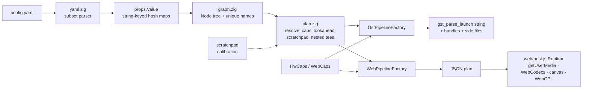

# camera_driver · Zig core + web runtime

A second implementation of the pipeline *core* in Zig, built so the same YAML
configs can drive either GStreamer (native) or the browser (wasm + web APIs).
No Emscripten, no WASI: the wasm module is `wasm32-freestanding`, ~130 KB, and
needs no imports.

The C++ framework in the parent directory is untouched and still the thing that
actually runs GStreamer. This directory is the portable half: parsing, graph,
caps negotiation, and "lowering" a graph to a backend.



## Design

* **Props are hash maps, not YAML nodes.** An element's options are a
  `StringHashMapUnmanaged(Value)` (`props.zig`). YAML is just one producer; a
  host could build the same tree from JSON or code.
* **Elements are data.** `elements.zig` is the comptime catalogue (type name,
  instance-name prefix, role, required options). Nothing registers itself at
  static-init time, and nothing needs `--whole-archive`.
* **Resolution is backend-independent.** `plan.resolve` walks the graph, tracks
  upstream caps, gives each element a look at what the *next* one prefers, and
  recurses into `MuxElement` branches. It does not know what a gst string or a
  canvas is.
* **A factory is a lowering.** It supplies `preferredInputs(node)` and
  `lower(ctx, node, branches)`; hardware/browser capability decisions live
  there (`HwCaps`, `WebCaps`), as the equivalents of the C++ resolver lambdas.
  Both factories are pure functions: no GStreamer link, no DOM, no filesystem.
* **Runtime attachment points are explicit.** Anything application code binds
  to (the old `getGstElement(name)` + `setup()` dance) comes back as a
  `Handle` (`frame_source`, `frame_sink`, `topic_writer`, ...). On the web the
  host exposes the same names through `Runtime.handles`.

## Build and test

Needs Zig 0.17.

```bash
cd zig
zig build test                 # 36 unit/regression tests
zig build                      # zig-out/bin/camera-driver-plan
zig build wasm                 # web/camera_driver.wasm
node web/test_core.mjs         # wasm core under plain Node
NODE_PATH=$(npm root -g) node web/test_browser.mjs   # headless Chromium, fake camera
```

The regression tests embed `config/*.yaml` from the repo root and assert the
exact launch strings the C++ elements produce.

## Using it

### CLI

```bash
camera-driver-plan config/example_pipeline.yaml
# v4l2src device=/dev/video0 do-timestamp=true ! image/jpeg,... ! x264enc ...

gst-launch-1.0 -e "$(camera-driver-plan config/debug_display.yaml --device /dev/video2)"

camera-driver-plan config/orbbec_lucid_pipeline.yaml --doc 2 --hw nvunixfdsrc,nvinferserver
camera-driver-plan config/orbbec_lucid_pipeline.yaml --backend web --doc 0   # JSON, exit 3 if parts are native-only
camera-driver-plan --list-elements
```

`--hw` lists the GStreamer elements that exist (`gst-inspect-1.0 | ...`); the
default is a plain desktop (`x264enc,jpegenc,avdec_h264`). The planner cannot
probe hardware itself, which is the main behavioural difference from the C++
core.

### Browser

```js
import { Core, Runtime, detectWebCaps } from './host.js';

const core = await Core.load('./camera_driver.wasm');
const plan = core.plan(yamlText, { backend: 'web', caps: await detectWebCaps() });
if (!plan.ok) console.log(plan.unsupported);          // native-only elements, with hints
const rt = await Runtime.start(plan, { core, canvas });
rt.handles.get('custom_pub_0').onFrame = (frame) => { /* ... */ };
```

`core.plan(yaml, { backend: 'gst', caps: 'nvh264enc,x264enc' })` works in the
page too, which makes a handy live config validator. Serve `web/` over HTTP and
open `index.html` for an editor + runner.

## Which elements run where

| Element | gst | web | web `impl` / note |
|---|:-:|:-:|---|
| `V4L2SrcElement` | ✓ | ✓ | `camera` (getUserMedia). Device selection by serial/port/format needs enumeration the planner can't do: pass `--device` / `Options.v4l2_devices` |
| `CustomSrcElement` | ✓ | ✓ | `push-source` (handle `write`) |
| `HttpMjpegSourceElement` | ✓ | ✓ | `http-mjpeg-source`; bridge from a native `MJPEGPublisher` to a page. **New** |
| `RTSPSourceElement` | ✓ | – | browsers can't speak RTSP |
| `NvUnixFdSrcElement`, `NVUnixFDPublisher`, `NvCUDAPublisher`, `IceOryxPublisher` | ✓ | – | host IPC / GPU memory |
| `MkvPlaybackElement`, `McapSourceElement` | ✓ | planned | host needs a demuxer / `@mcap/core` (`WebCaps.matroska`, `.mcap`); no host impl yet |
| `OptimizedConverter` | ✓ | ✓ | `encode-jpeg` (canvas), `encode-h264` (WebCodecs) |
| `AutoVideoConverterElement` | ✓ | ✓ | `convert` |
| `UndistortElement` | ✓ | ✓ | `undistort-webgpu`, else `undistort-cpu` (wasm kernel) |
| `InferServerElement`, `GstElement` | ✓ | – | DeepStream / raw gst |
| `MuxElement` | ✓ | ✓ | `tee` (clones `VideoFrame`s per branch) |
| `DisplayPublisher` | ✓ | ✓ | `canvas-display` |
| `CustomPublisher` | ✓ | ✓ | `callback-sink` |
| `MkvRecorderElement`, `McapSinkElement` | ✓ | planned | as above |
| `MJPEGPublisher` | ✓ | – | a page can't listen on a port |
| `ROS2Publisher` | ✓ (C++ build) | – | use rosbridge/foxglove websocket |

Elements the web backend can't run are reported in `plan.unsupported` with a
reason and a suggested alternative; `plan.ok` is false and `Runtime.start`
throws `UnsupportedPlanError` rather than silently dropping them.

## Adding an element

1. Add a `Spec` to `src/elements.zig` (name, prefix, role, required options).
2. Add a branch to `lower()` (and `preferredInputs()` if it has preferences) in
   `gst_factory.zig` and/or `web_factory.zig`. Return the backend payload and
   the caps it outputs; register any `Handle`s it exposes.
3. For the web, implement the `impl` id in `web/host.js`'s `impls` table.
4. Add a regression test in `src/tests.zig` with the expected output.

## Status and known gaps

* The Zig side **plans**; it does not run GStreamer. Execution is still the C++
  runtime or `gst-launch-1.0`. Wiring `handles`/`side_files` into the C++
  `Pipeline` (so it can consume a Zig-produced plan) is not done.
* Strings are compared against what the C++ source *would* emit, not against a
  live C++ build in CI. One deliberate difference: the C++ `buildMJPEGPath`
  drops the ` ! ` between `nvvidconv ! video/x-raw,format=I420` and the encoder
  when the input is NVMM, there is `nvvidconv` but no `nvjpegenc`; the port
  inserts it.
* `McapSourceElement` reads its codec from the file in C++. A planner can't, so
  it takes `codec: h264|raw` (+ `format/width/height/fps`) as options.
  Likewise metadata embedded in `.mkv`/`.mcap` is only visible to the planner if
  the host supplies it (`Options.recording_metadata` / `metadata`).
* YAML support is a subset (see `yaml.zig`): no anchors, tags or block scalars.
* Web: `undistort-cpu` and the camera → canvas → JPEG path are exercised in
  headless Chromium. `undistort-webgpu` and `encode-h264` are written but not
  verified here (the headless stack has no working WebGPU canvas readback and
  no H.264 encoder); `detectWebCaps()` only advertises them when a runtime probe
  passes, so such hosts fall back to the CPU path automatically.
