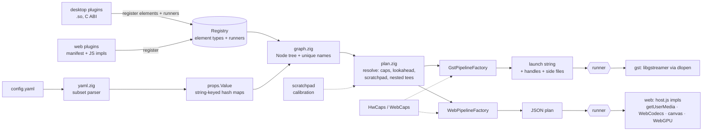

# camera_driver · Zig core + web runtime

A second implementation of the pipeline *core* in Zig, built so the same YAML
configs can drive either GStreamer (native) or the browser (wasm + web APIs).
No Emscripten, no WASI: the wasm module is `wasm32-freestanding`, ~130 KB, and
needs no imports.

The C++ framework in the parent directory is untouched and still the thing that
runs MCAP, ROS2, IceOryx and CUDA today. The plan is for those to move behind the
plugin ABI below (they keep their C++ code) rather than be rewritten, and for
this directory to become the only core.



## Design

* **Props are hash maps, not YAML nodes.** An element's options are a
  `StringHashMapUnmanaged(Value)` (`props.zig`). YAML is just one producer; a
  host could build the same tree from JSON or code.
* **Elements are data in a runtime registry.** `registry.zig` holds each element's
  type name, instance-name prefix, role, required options and how it is lowered.
  The built-ins (`elements.zig`) are seeded into it; plugins add more. Nothing
  registers itself at static-init time and nothing needs `--whole-archive`.
* **Resolution is backend-independent.** `plan.resolve` walks the graph, tracks
  upstream caps, gives each element a look at what the *next* one prefers, and
  recurses into `MuxElement` branches. It does not know what a gst string or a
  canvas is.
* **A factory is a lowering.** It supplies `preferredInputs(node)` and
  `lower(ctx, node, branches)`; hardware/browser capability decisions live
  there (`HwCaps`, `WebCaps`), as the equivalents of the C++ resolver lambdas.
  Both factories are pure functions: no GStreamer link, no DOM, no filesystem.
* **The runner (finalizer) is a plugin too.** Planning produces a plan; a
  *runner* executes it. The desktop default builds the launch string with
  GStreamer and plays it, the web default instantiates JS impls; either can be
  swapped by name (`--runner`, `Runtime.start(plan, {runner})`) or replaced by a
  plugin. See **Plugins** below.
* **Runtime attachment points are explicit.** Anything application code binds
  to (the old `getGstElement(name)` + `setup()` dance) comes back as a
  `Handle` (`frame_source`, `frame_sink`, `topic_writer`, ...). On the web the
  host exposes the same names through `Runtime.handles`.

## Build and test

Needs Zig 0.17.

```bash
cd zig
zig build test                 # 51 tests: unit, regression, plugin ABI, runners, real GStreamer
zig build                      # zig-out/bin/camera-driver-plan
zig build wasm                 # web/camera_driver.wasm
node web/test_core.mjs         # wasm core under plain Node
NODE_PATH=$(npm root -g) node web/test_browser.mjs   # headless Chromium, fake camera
```

The regression tests embed `config/*.yaml` from the repo root and assert the
exact launch strings the C++ elements produce.

## Using it

### CLI

```bash
camera-driver-plan config/example_pipeline.yaml
# v4l2src device=/dev/video0 do-timestamp=true ! image/jpeg,... ! x264enc ...

gst-launch-1.0 -e "$(camera-driver-plan config/debug_display.yaml --device /dev/video2)"

camera-driver-plan config/orbbec_lucid_pipeline.yaml --doc 2 --hw nvunixfdsrc,nvinferserver
camera-driver-plan config/orbbec_lucid_pipeline.yaml --backend web --doc 0   # JSON, exit 3 if parts are native-only
camera-driver-plan --list-elements                       # type, role, which plugin provided it
camera-driver-plan --list-runners
```

Plugins and running:

```bash
camera-driver-plan cfg.yaml --plugin zig-out/lib/libcd_example_cpp.so   # native plugin (repeatable)
camera-driver-plan cfg.yaml --manifest extra.json                       # declarative plugin
camera-driver-plan cfg.yaml --run                                       # plan, then execute (default runner: gst)
camera-driver-plan cfg.yaml --run --runner dry-run                      # same lifecycle, executes nothing
```

`--run` loads `libgstreamer-1.0.so.0` at runtime, so building needs no GStreamer
headers and a machine without GStreamer gets a clear error instead of a link
failure. Ctrl-C stops the pipeline cleanly.

`--hw` lists the GStreamer elements that exist (`gst-inspect-1.0 | ...`); the
default is a plain desktop (`x264enc,jpegenc,avdec_h264`). The planner cannot
probe hardware itself, which is the main behavioural difference from the C++
core.

### Browser

```js
import { Core, Runtime, detectWebCaps } from './host.js';

const core = await Core.load('./camera_driver.wasm');
const plan = core.plan(yamlText, { backend: 'web', caps: await detectWebCaps() });
if (!plan.ok) console.log(plan.unsupported);          // native-only elements, with hints
const rt = await Runtime.start(plan, { core, canvas });
rt.handles.get('custom_pub_0').onFrame = (frame) => { /* ... */ };
```

`core.plan(yaml, { backend: 'gst', caps: 'nvh264enc,x264enc' })` works in the
page too, which makes a handy live config validator. Serve `web/` over HTTP and
open `index.html` for an editor + runner.

## Plugins

There are two plugin backends, one per platform, feeding the same registry.
A plugin can add **elements** (how a `type:` is lowered) and **runners** (how a
plan is executed).

| | Desktop backend | Web backend |
|---|---|---|
| Unit | shared library (`.so`/`.dylib`/`.dll`) | manifest (JSON) + JS module |
| Loaded by | `plugin_desktop.zig` via `dlopen` | `manifest.zig` (also compiled into the wasm) + `loadWebPlugin()` |
| Interface | C ABI, [`include/camera_driver_plugin.h`](include/camera_driver_plugin.h) | manifest schema + `registerImpl()` / `registerRunner()` |
| Languages | anything that can export C symbols: C, C++, Zig, Rust | JS/TS (and wasm if a JS shim loads it) |
| Typical use | existing C++ elements (MCAP, ROS2, IceOryx, CUDA) | browser-only elements, custom sources/sinks |

### Native plugin (C ABI)

A plugin exports `int cd_plugin_init(const cd_host_api*)` and registers
`cd_element_def` / `cd_runner_def` structs. An element supplies:

* `lower` — write a GStreamer fragment and the caps leaving the element (planning),
  using host helpers to read options (`props_get_*`), declare runtime handles
  (`add_handle`), warn, and ask whether a GStreamer element exists (`has_element`);
* optional `create` / `setup(native_pipeline)` / `bringdown` / `destroy` — run
  around the pipeline's lifetime, with the runner's native handle (a
  `GstPipeline*`), replacing the old `getGstElement(name)` + `setup()` pattern;
* `web_impl` / `web_reason` — the browser `impl` for the web backend, or why none.

Only C types cross the boundary (no `std::string`, no exceptions); host-owned
strings are valid for the duration of the call and strings you return are copied.
[`examples/cpp_plugin.cpp`](examples/cpp_plugin.cpp) wraps an ordinary C++ class
this way, and `test/toy_plugin.c` is the smallest C one. Both are loaded by the
test-suite. The ABI is versioned (`CD_ABI_VERSION`); a mismatching host makes
`cd_plugin_init` return `-100`.

### Web plugin

```js
import { Core, loadWebPlugin } from './host.js';
await loadWebPlugin(core, {
  manifest: { plugin: 'tint', elements: [{
    type: 'RedTint', prefix: 'red_tint', role: 'transform',
    gst: { template: 'videobalance saturation=2' },   // desktop lowering, {option} / {option|default} / {name}
    web: { impl: 'tint-red' },                         // or { unsupported: 'reason' }
  }]},
  impls: { 'tint-red': async (stage, emit, ctx) => ({ push: (frame) => emit(process(frame)) }) },
});
```

The same manifest works with `camera-driver-plan --manifest`, so a purely
declarative element needs no native code on either platform.

### Runners

A runner is the swappable finalizer, with one contract on both platforms:
`build(plan)` → `play` → `wait` → `stop` → `destroy`, plus access to the native
handle and named elements. `exec.zig` drives plugin-element hooks around it in a
fixed order (`create`, `setup`, `play`, `wait`, `bringdown`, `destroy`), so every
runner behaves the same. Built in: `gst` (desktop), `dry-run`, and `web`
(browser). Native plugins can register more (`cd_runner_def`), e.g. one that
wraps an existing C++ `Pipeline` or adds a ROS-aware event loop.

## Which elements run where

| Element | gst | web | web `impl` / note |
|---|:-:|:-:|---|
| `V4L2SrcElement` | ✓ | ✓ | `camera` (getUserMedia). Device selection by serial/port/format needs enumeration the planner can't do: pass `--device` / `Options.v4l2_devices` |
| `CustomSrcElement` | ✓ | ✓ | `push-source` (handle `write`) |
| `HttpMjpegSourceElement` | ✓ | ✓ | `http-mjpeg-source`; bridge from a native `MJPEGPublisher` to a page. **New** |
| `RTSPSourceElement` | ✓ | – | browsers can't speak RTSP |
| `NvUnixFdSrcElement`, `NVUnixFDPublisher`, `NvCUDAPublisher`, `IceOryxPublisher` | ✓ | – | host IPC / GPU memory |
| `MkvPlaybackElement`, `McapSourceElement` | ✓ | planned | host needs a demuxer / `@mcap/core` (`WebCaps.matroska`, `.mcap`); no host impl yet |
| `OptimizedConverter` | ✓ | ✓ | `encode-jpeg` (canvas), `encode-h264` (WebCodecs) |
| `AutoVideoConverterElement` | ✓ | ✓ | `convert` |
| `UndistortElement` | ✓ | ✓ | `undistort-webgpu`, else `undistort-cpu` (wasm kernel) |
| `InferServerElement`, `GstElement` | ✓ | – | DeepStream / raw gst |
| `MuxElement` | ✓ | ✓ | `tee` (clones `VideoFrame`s per branch) |
| `DisplayPublisher` | ✓ | ✓ | `canvas-display` |
| `CustomPublisher` | ✓ | ✓ | `callback-sink` |
| `MkvRecorderElement`, `McapSinkElement` | ✓ | planned | as above |
| `MJPEGPublisher` | ✓ | – | a page can't listen on a port |
| `ROS2Publisher` | ✓ (C++ build) | – | use rosbridge/foxglove websocket |

Elements the web backend can't run are reported in `plan.unsupported` with a
reason and a suggested alternative; `plan.ok` is false and `Runtime.start`
throws `UnsupportedPlanError` rather than silently dropping them.

## Adding an element

*As a plugin* (preferred for anything non-core): write a manifest, or a native
plugin as above.

*As a built-in*:

1. Add a `Spec` to `src/elements.zig` (name, prefix, role, required options).
2. Add a branch to `lower()` (and `preferredInputs()` if it has preferences) in
   `gst_factory.zig` and/or `web_factory.zig`. Return the backend payload and
   the caps it outputs; register any `Handle`s it exposes.
3. For the web, implement the `impl` id in `web/host.js`'s `impls` table.
4. Add a regression test in `src/tests.zig` with the expected output.

## Status and known gaps

* **The existing C++ elements are not yet wrapped.** The plugin mechanism, a C
  example, a C++ example and the toy fixtures are in; `McapSink/Source`,
  `ROS2Publisher`, `IceOryxPublisher`, `NvCUDAPublisher` still live in the legacy
  C++ core and need their shims (and, for the elements that call
  `getGstElement`, a switch to the `setup(native_pipeline)` hook). That work needs
  the real dependencies (mcap, rclcpp, iceoryx, CUDA/DeepStream) to build and test.
* **The gst runner is verified against a stub and the system GStreamer core
  elements** (`fakesrc`, `queue`, `tee`, `filesrc`, ...): EOS, bus errors with
  GStreamer's own message, parse errors, refused state changes, Ctrl-C, and plugin
  hooks receiving the real `GstPipeline*`. It has not been run with camera,
  NVIDIA or encoder plugins; no such plugins exist in the development container.
* **Runtime handles are only partly exposed.** The plan lists them and the runner
  can `findElement(name)`, but wrappers for pushing frames into an `appsrc` or
  pulling from an `appsink` from application code (the `CustomSrc`/`CustomPublisher`
  API) are not written for the Zig side yet. (On the web they are: `handles`.)
* The strings the gst factory emits are compared against what the C++ source
  *would* emit, not against a live C++ build in CI. One deliberate difference:
  the C++ `buildMJPEGPath` drops the ` ! ` between `nvvidconv ! video/x-raw,format=I420`
  and the encoder when the input is NVMM, there is `nvvidconv` but no
  `nvjpegenc`; the port inserts it.
* The planner cannot enumerate cameras or probe hardware; give it `--device` and
  `--hw`. `McapSourceElement` takes `codec: h264|raw` (+ `format/width/height/fps`)
  because it can't open the file, and metadata embedded in recordings has to be
  supplied by the host (`Options.recording_metadata` / `metadata`).
* **Loading a native plugin runs its code** with the host's privileges. Plugin
  paths come from the command line / config you control; do not take them from
  untrusted input. Plugins must be built for the same GStreamer major version and
  `CD_ABI_VERSION`. Plugin init is not thread-safe.
* YAML support is a subset (see `yaml.zig`): no anchors, tags or block scalars.
* Web: `undistort-cpu` and the camera → canvas → JPEG path, a manifest + JS-impl
  plugin and runner swapping are exercised in headless Chromium. `undistort-webgpu`
  and `encode-h264` are written but not verified here (the headless stack has no
  working WebGPU canvas readback and no H.264 encoder); `detectWebCaps()` only
  advertises them when a runtime probe passes, so such hosts fall back to the CPU
  path automatically. There is no web implementation yet for Matroska/MCAP
  recording or playback.
